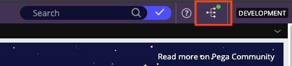
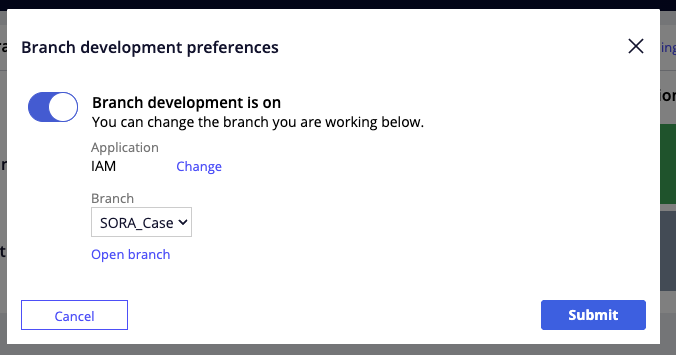
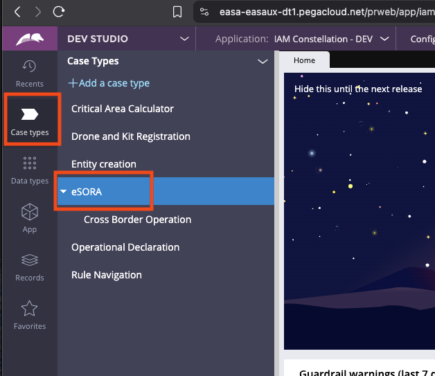
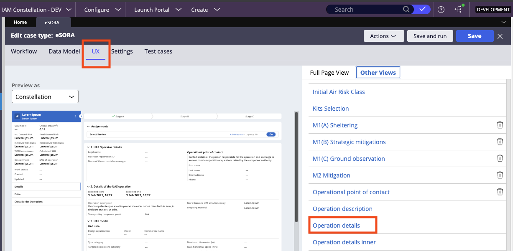
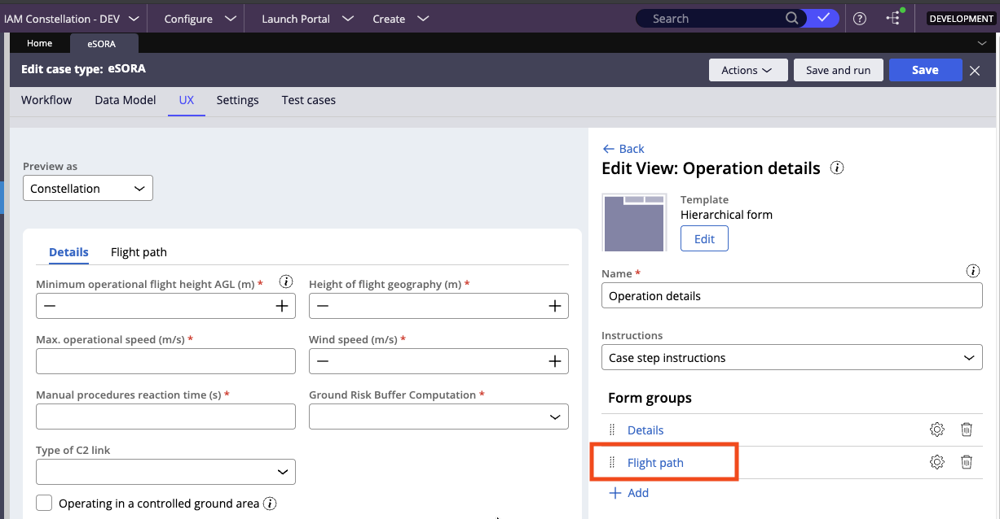
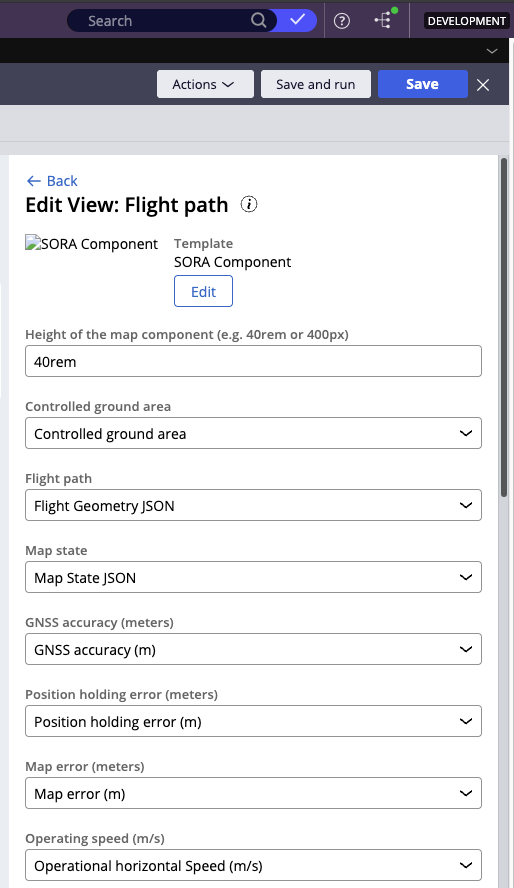
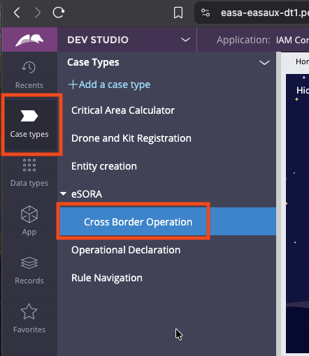
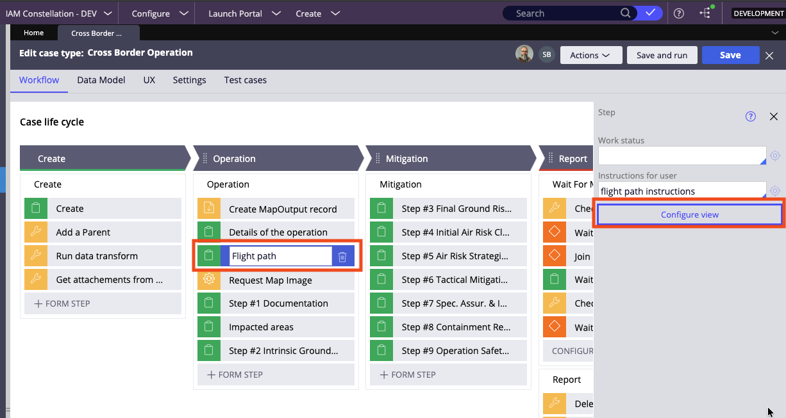
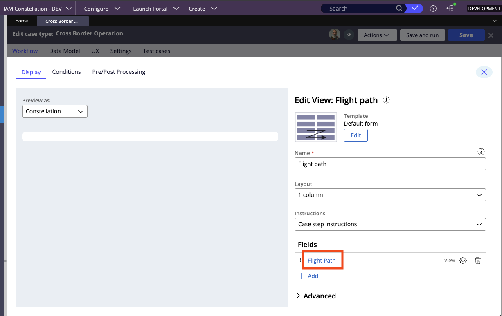
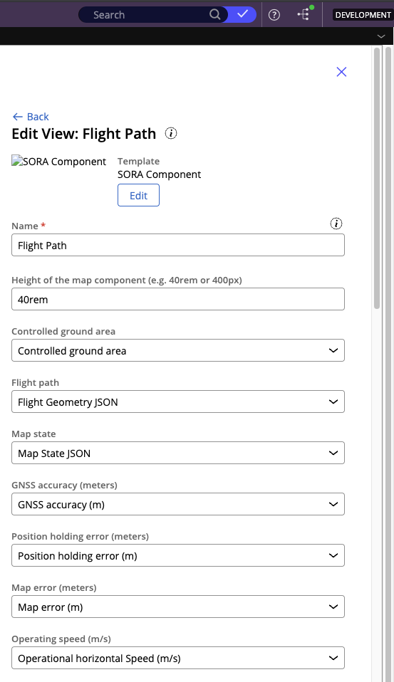

# EASA Extensions SORA Component

A comprehensive SORA (Specific Operations Risk Assessment) component for drone operations risk analysis and visualization. This component provides interactive mapping capabilities, population density analysis, geozone assessment, and flight volume calculations for drone operations.

## Overview

The SORA component is designed to help users assess and visualize drone operation risks by providing:

- **Interactive Map**: Built with ArcGIS JS API for advanced mapping capabilities
- **Population Density Analysis**: Real-time population density calculations and visualization
- **Geozone Assessment**: Analysis of intersecting geozones and regulatory areas
- **Flight Path Management**: Upload and manage flight paths in various formats (GeoJSON, KML)
- **Risk Calculations**: Comprehensive risk assessment based on SORA methodology
- **Print/Export**: Generate printable maps and export data

## Data Sources

- Population density data from ArcGIS Online
- Geozone data for regulatory compliance
- Land use data for risk assessment
- Basemap services for visualization

## Development

### Getting Started

#### Prerequisites

- Node.js (version 14 or higher)
- npm (version 6 or higher)

#### Installation

1. Navigate to the root directory of the project:

   ```bash
   cd /path/to/easa-dxcomponents
   ```

2. Install dependencies:

   ```bash
   npm install
   ```

3. Start the development server:
   ```bash
   npm start
   ```

The application will start on `http://localhost:6006` and open in your default browser.

### Project Structure

```
EASA_Extensions_SORA/
├── components/          # React components
├── config/             # Configuration files
├── flight-volume/      # Flight volume calculations
├── geojson/           # Sample GeoJSON data
├── geozone-definitions.ts
├── hooks/             # Custom React hooks
├── kml/               # Sample KML data
├── legends/           # Map legend components
├── map/               # Map-related components
├── schemas/           # JSON schemas
├── tools/             # Map tools and utilities
├── utils/             # Utility functions
├── config.json        # Component configuration
├── index.tsx          # Main component
└── types.ts           # TypeScript type definitions
```

### Available Scripts

- `npm start` - Start the development server
- `npm run build-storybook` - Build the storybook for production
- `npm run test` - Run tests
- `npm run lint` - Run linting
- `npm run fix` - Fix linting issues

## Usage

The SORA component can be integrated into Pega applications as a custom DX component. It provides a comprehensive interface for drone operation risk assessment with interactive mapping capabilities.

## Dependencies

- React 17.0.2
- ArcGIS JS API 4.30.9
- Pega Constellation UI components
- Various utility libraries for mapping and data processing

## Deployment to Pega System

### Prerequisites for Deployment

Before deploying the component to a Pega system, you need to update the `tasks.config.json` file in the root directory with the appropriate server configuration.

### Deployment Steps

1. **Update Configuration**:

   - Edit `tasks.config.json` in the root directory
   - Configure the server settings including:
     - Server URL
     - Ruleset name and version
     - Authentication credentials
     - Client ID and secret

   The `tasks.config.json` file should contain the following structure:

   ```json
   {
     "server-config": {
       "rulesetName": "DXComponentFlightPaths_Branch_SORA_Case",
       "rulesetVersion": "01-01-01",
       "server": "https://your-pega-server.com/prweb",
       "user": "your-username",
       "password": "your-password",
       "clientId": "your-client-id",
       "clientSecret": "your-client-secret"
     }
   }
   ```

2. **Authenticate with Pega System**:

   ```bash
   npm run authenticate
   ```

   This command will connect to the Pega system using the credentials specified in `tasks.config.json`.

3. **Publish the Component**:

   ```bash
   npm run publish
   ```

4. **Follow the Interactive Prompts**:
   - **Select component to publish**: Choose `EASA_Extensions_SORA` from the list
   - **Ruleset name**: Press Enter to accept the default (or specify custom)
   - **Ruleset version**: Press Enter to accept the default (or specify custom)
   - **Generate development build?**: Enter `y` for yes
     - **Important**: This is required for components using ArcGIS JS API. The component will not publish successfully without a development build.

### Troubleshooting Deployment

- Ensure all authentication credentials are correct
- Verify the server URL is accessible
- Make sure to select "y" for development build when prompted
- Check that the ruleset name and version exist in the target Pega system

### Post-Deployment Configuration

Once the component is successfully published, you need to configure it in the Pega system. This process involves three main steps: configuring the development branch, configuring the component within the eSORA case type, and configuring the component within the CBO (Cross Border Operation) case type.

#### Configure Development Branch

1. **Access the Pega Site**:

   - Navigate to [https://easa-easaux-dt1.pegacloud.net/prweb/app/iam-constellation--dev](https://easa-easaux-dt1.pegacloud.net/prweb/app/iam-constellation--dev)
   - Log in with your credentials

2. **Select Development Branch**:

   - Locate the branch selector in the top right corner of the page
   - Click on the branch selector
   - In the "Branch development preferences" modal:
     - Ensure "Branch development is on" toggle is enabled
     - Select "SORA_Case" from the Branch dropdown
     - Click "Submit" to confirm

   
   _Branch selector icon in top right corner (icon with branching lines and green dot)_

   
   _Branch development preferences modal with "Branch development is on" toggle and SORA_Case selection_

#### Configure Component in eSORA Case Type

1. **Navigate to Case Types**:

   - In the left navigation menu, select "Case types"
   - From the list of case types, select "eSORA"

   
   _Left navigation menu with "Case types" highlighted and case types list with "eSORA" highlighted in blue_

2. **Access Component Configuration**:

   - Once in the eSORA case type, click "UX" from the top menu bar
   - In the right pane, click "Other Views"
   - Select "Operation details" from the available views

   
   _UX menu with "Other Views" and "Operation details" selection_

3. **Locate Flight Path in Form Groups**:

   - In the view editor, locate "Flight Path" in the Form groups section
   - Click on "Flight Path" to open the component configuration form

   
   _"Flight path" highlighted with red outline in Form groups_

4. **Configure Flight Path Properties**:

   - Map all component properties to corresponding Pega database properties

   
   _"Edit View: Flight path" with SORA Component configuration form_

#### Configure CBO (Cross Border Operation) Case Type

1. **Navigate to CBO Case Type**:

   - In the left navigation menu, select "Case types"
   - From the list of case types, select "Cross Border Operation"

   
   _Case types list with "Cross Border Operation" selected_

2. **Access CBO Configuration**:

   - Once in the CBO case type, click "Configure" from the top menu bar
   - Select "View" from the configuration options

   
   _CBO case type with "Configure" menu and "View" selection_

3. **Select Flight Path Display**:

   - In the view configuration, locate "Flight Path" in the display options
   - Select "Flight Path" to configure the component

   
   _"Flight Path" option in CBO display configuration_

4. **Configure CBO Flight Path Properties**:

   - Map all component properties to corresponding Pega database properties for the CBO case type

   
   _"Edit View: Flight path" with SORA Component configuration for CBO case type_

### Property Mapping

All properties in the configuration form need to be mapped to properties from the Pega database for both eSORA and CBO case types.

For assistance with property mapping, contact:

- **Emilieno**: Max.MartinezRivera@pega.com
- **Szymon**: Szymon.Banowski@pega.com

## Support

For technical support and questions, please refer to the main project documentation or contact the development team.

**Project Team:**

- **Lead Developer**: James Eyre (j.eyre@esri.ch)
- **Project Manager**: Nina Katharina Jeanne Mannschott (n.mannschott@esri.de)
